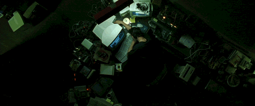

# Install Party!

---

# Let's Review the Terminal

1. Hit Command-Space to open Spotlight
2. Begin typing the word 'Terminal'
3. When you see Terminal.app show up in the list, hit enter to open it

---

---

# Basic Commands (1 of 3)
* cd
* ls
* mkdir
* open

---

# Basic Commands (2 of 3)
* mv
* cp
* rm

---

# Basic Commands (3 of 3)
* touch
* cat
* less

---

# Quitting Commands

Sometimes, you start a command in the terminal and need to stop it before it ends execution on its own. To do this, hit Ctrl-C. Sometimes you may have to hit this a couple of times.

---

---

# Installing XCode

First, we need to run: `xcode-select --install`

Then, we need to run: `sudo xcodebuild -license`

---

# Super Install Script

I've emailed each of you a script called `super-installer.sh`. Save it to your Desktop.

With a little luck, it'll install most of our remaining developer tools.

---

---

# SSH Keys

We need to create SSH keys to easily interact with GitHub. Run the following command to generate one:

`ssh-keygen -t rsa -b 4096 -C "your_email@here.com"`

Then run the following command:

`ssh-add ~/.ssh/id_rsa`

---

# Adding Our Key to GitHub

Copy the key by running the following:

`cat ~/.ssh/id_rsa.pub | pbcopy`

Then login to your GitHub account and add it under settings.

---

# Installing Atom Packages (1 of 2)

* atom-ternjs
* autocomplete-modules
* atom-beautify
* autocomplete-paths
* emmet
* file-icons

---

# Installing Atom Packages (2 of 2)
* linter
* linter-csslint
* linter-eslint
* linter-htmlhint
* open-recent
* pigments

---

# Making Atom Pretty!

* One Dark UI Theme
* Base16 Tomorrow Dark Theme
* Source Code Pro Font

---

# Atom Command Basics

* Command+c to Copy
* Command+v to Paste
* Command+s to Save
* Command+p to Find File
* Command+\ to Hide File Tree

---

# Making iTerm2 Pretty!

* 12pt Source Code Pro Light Font
* Dark Background

---

# Enabling Alfred

* Disable Spotlight Keyboard Shortcut
* Add Alfred Keyboard Shortcut
* Launch Alfred on Start
* Theme him up!

---

# Screen Space

* Hide Menu Bar
* Hide Dock

---

# Notifications!

* Notification Settings
* Do Not Disturb Mode
